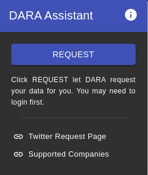
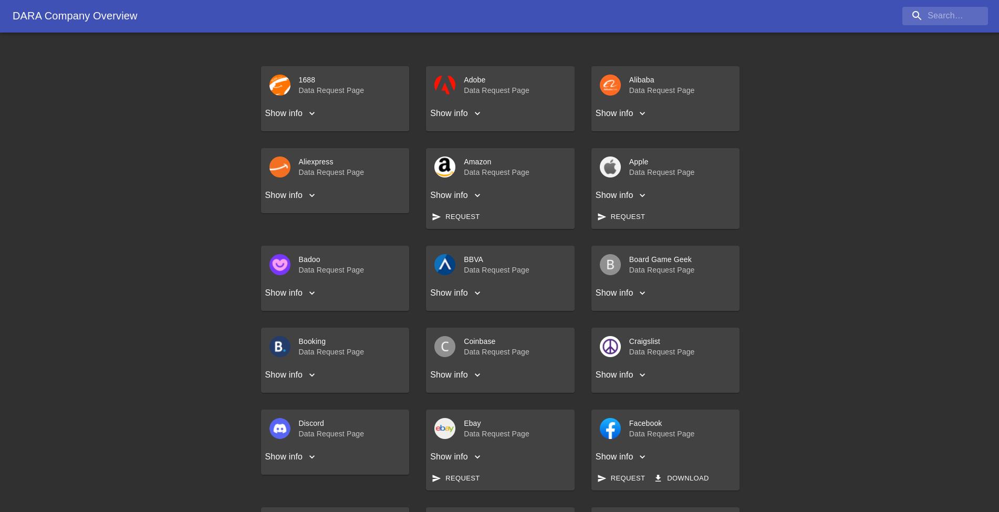
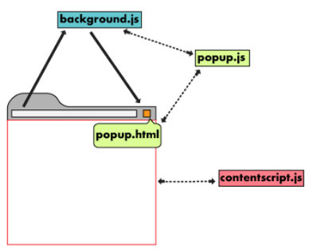
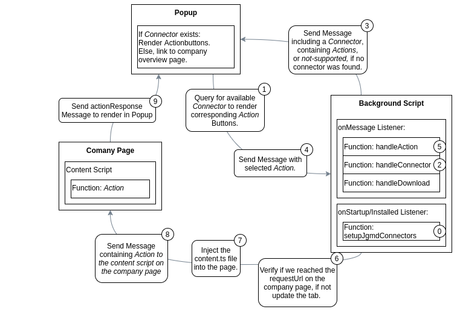

## The DARA Assistant: A journey through extension land.

So we got together as a group to tackle the problem of simplifying data access requests.
In our first phase of researching the topic we found some projects doing quite similar things: [aeon](https://aeon.technology/) manages data access requests very well — also offering some visualization of the data requested. We borrowed many ideas from aeon, but still decided to take another technical approach: Their app is based on electron and is a classical desktop app — we wanted to build something a bit easier to access, where we don't have to take care of the deploying and updating infrastructure and ended up with the browser extension platform. In this domain we also found some projects close to our vision:

- There is [udaptor.io](https://chrome.google.com/webstore/detail/data-access-assistant-cla/dkjggcigbjhapffcjbmbgbbffgobfeol?hl=de), a very promising browser extension, doing exactly what we want! Unfortunately it seems to be abandoned, of the few companies supported (6) barely any actually work. Sadly their code is not open source, otherwise we maybe could have fixed those issues and build upon their work.
- And there is the [Opt Out-tool](https://chrome.google.com/webstore/detail/opt-out-send-gdpr-and-ccp/dedldhojjkgbejnmmfpmbnbihmmpfbpd?hl=de), this extension is basically a link to a data access request email generator. Nothing interessting to see here.

So it was up to us to create a hopefully useful and practical tool.

## First considerations

When you plan to build a browser extension you quickly find that there is basically only one platform to use: the [WebExtensions](https://de.wikipedia.org/wiki/Browser_Extensions) framework, as it is supported by the fast majority of installed browsers. Only Safari as a quite widely used browser doesn't support the platform. Firefox and most of the Chrome derivates (like Opera) support it.

**V2 vs V3?!.** We decided to first target Chrome as main reference browser to develop and test on and were confronted with the [manifest v2 vs v3](https://developer.chrome.com/docs/extensions/mv3/intro/) question. The Google Chrome developers specified a new version 3 of the WebExtension framework, and although we gave our best to use the new and shiny version, we just couldn't make it work for us (e.g. downloads through the extension seem to have issues still). And when we found out that Firefox wasn't supporting v3 yet, the decision for v2 was easy.

**TypeScript and React.** Browser extensions are written per default in JavaScript and follow a quite [clear structure](https://developer.chrome.com/docs/extensions/mv3/architecture-overview/). Mere out of curiosity than real necessity, we headed for a React and TypeScript based approach. There are well written [guides](https://medium.com/swlh/how-to-build-a-chrome-extension-with-react-typescript-and-webpack-92e806ce2e16), [boilerplates](https://github.com/pixochi/create-react-chrome-extension-ts) and [whole toolkits](https://www.extend-chrome.dev/) for this task. Still, it is a trade-off adding complexity and little annoyances like a longer compile time to your project.



## Concept / Functionality / Userstory

Generally our extension should enable the following flow: A Person interested in requesting their data visits a company's website, they click on the assistant icon and get offered the available options for this company — if an automated request is available, a request button is displayed. After clicking the button the extension takes over, opens the corresponding data request page and injects the necessary clicks to send of the data request.  
  

The extension also offers an overview of all supported companies. If automated actions are available, corresponding buttons are displayed on the company's entry. If clicked the data request page in question is opened in a new tab.



## The Architecture 



A WebExtension can contain 3 main components: A popup, shown to the user when they click on the extension icon; background \'pages\' running service workers for asynchronous, popup independent tasks; and content scripts, to be injected into webpages — able to access and modify the page's content. For a better understanding of the interactions and differing permissions between those components we can recommend the [Chrome Developer pages](https://developer.chrome.com/docs/extensions/mv3/architecture-overview/) and [MDN Web Docs](https://developer.mozilla.org/en-US/docs/Mozilla/Add-ons/WebExtensions) on WebExtensions, as well as this [YouTube playlist](https://shiffman.net/a2z/chrome-ext/).


Following we will explain how we implemented the mentioned components in the Assistant context.

### Content Script
We first tried to go with a simpler setup, omitting a separate content script and just injecting the respective click paths via the [`tabs.executeScript`](https://developer.mozilla.org/en-US/docs/Mozilla/Add-ons/WebExtensions/API/tabs/executeScript) API. But soon felt the limitations of this approach: importing and reusing code is not possible from within the injected code via `tabs.executeScript`. Which led us to programmatically inject a content script, which adds a message listener via the `runtime.onMessage` API. We now can send a message to the content script containing an *Action* name to be executed.

```ts
chrome.runtime.onMessage.addListener(async (message, sender, sendResponse) => {
    console.log("Received message in content script.", message)
    if (message.action) {
        const { hostname } = new URL(window.location.href ?? "");
        const connector:any = await Utils.getConnector(hostname);
        connector[message.action]();
    }
});
```

### Background Script
Our background script handles most of the logic of the extension. It consists out of two listeners: A `runtime.onStartup` and `runtime.onInstalled` listener which makes sure the descriptions from JustGetMyData.com are always available in the extension's local browser storage; and a `runtime.onMessage` listener, which currently handles three kinds of messages:

```ts
chrome.runtime.onMessage.addListener(async (message) => {
  console.log("Message received in background!", message);
  if (message.action) {
    handleAction(message);
  } else if (message.getConnector) {
    handleGetConnector();
  } else if (message.download) {
    handleDownload(message);
  }
});
```

- `message.action` will be received when the user has picked an action from the popup or from the overview page. Now we need to make sure the current tab points to the data request page, as specified in the `connector.requestUrl` var. This is done as part of the `loadUrl` function. When we reached the correct URL for the tab in question, we can inject the content script and subsequently send a message including the action to be executed.

- `message.getConnector` is sent by the popup script. To find a matching connector, we need to retrieve the current tab's hostname, which is done via the `tabs.query` endpoint. The hostname is passed to the `getConnector()` function, which first retrieves the company descriptions from the storage API and then merges them with the assistants connectors. The resulting array is then searched for a connector, containing a matching hostname. The so found connector is sent back to the popup script.

- `message.download` is received when a content script has access to data to be directly downloaded by the user. Since content scripts can't use the `downloads.download` endpoint, we need to take the detour via the background script and send the created blob URL as `message.downloadUrl` for downloading.

We made a diagram to vizualize the described functionality:



### Popup

The popup is build with React. Every time a user clicks on the icon a `getConnector` message is send to the background script. Depending on the response different parts are displayed in the popup. Utilizing the `&&` syntax:
```tsx
{!support &&
    <NoSupport />
}
```
As long as the `support` variable is truthy, the `<NoSupport />` React component won't be displayed. As soon as this variable becomes falsy, the popup gets re-rendered including the `<NoSupport />` component.

If a received message includes a `connector` object, the actions and description variables set with the corresponding object properties. If `notSupported` is received the support variable is set to false and if `actionResponse` is received the response variable is set.

For all variables which depend on an external source, like a message, we need to use Reacts `useState()` function. For the retrieved actions we use this line: 
```ts
const [actions, setActions] = React.useState<Array<string>>([]);
```
and when we received a message we set the actions variable like this:
```tsx
if (message.connector) {
        connector = message.connector;
        setActions(connector.actions);
}
```
To not trigger countless re-renders on every variable change, we need to include the setting of variables in a React [`useEffect()`](https://reactjs.org/docs/hooks-effect.html) context. To make sure our code only runs on the first render we can supply [`useEffect()`](https://reactjs.org/docs/hooks-effect.html) with an empty array as second argument. 

The full section looks currently like this:
```tsx
const [actions, setActions] = React.useState<Array<string>>([]);
const [description, setDescription] = React.useState<string>("");
const [support, setSupport] = React.useState<boolean>(true);
const [response, setResponse] = React.useState<string>("");

React.useEffect(() => {
    chrome.runtime.sendMessage({ getConnector: true });
    chrome.runtime.onMessage.addListener((message) => {
        if (message.connector) {
        connector = message.connector;
        setActions(connector.actions);
        setDescription(connector.description);
        chrome.runtime.onMessage.removeListener(message);
        } else if (message.notSupported) {
        setSupport(false);
        chrome.runtime.onMessage.removeListener(message);
        } else if (message.actionResponse) {
        setResponse(message.actionResponse);
        chrome.runtime.onMessage.removeListener(message);
        }
    });
}, []);
```


